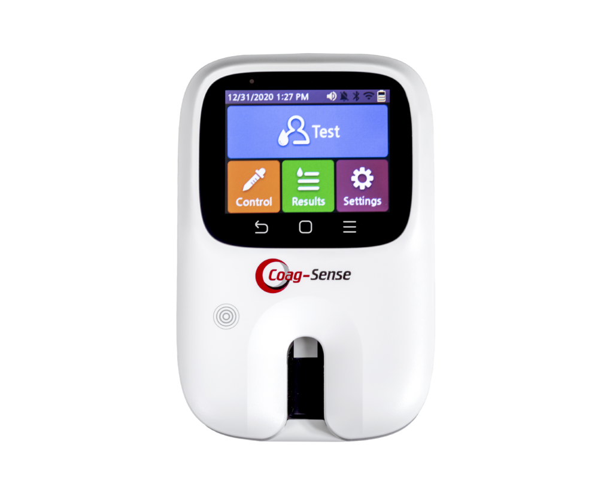
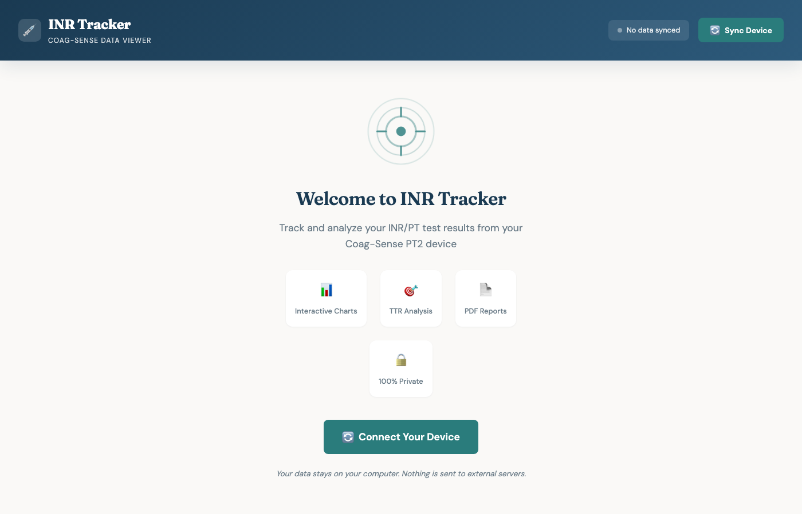
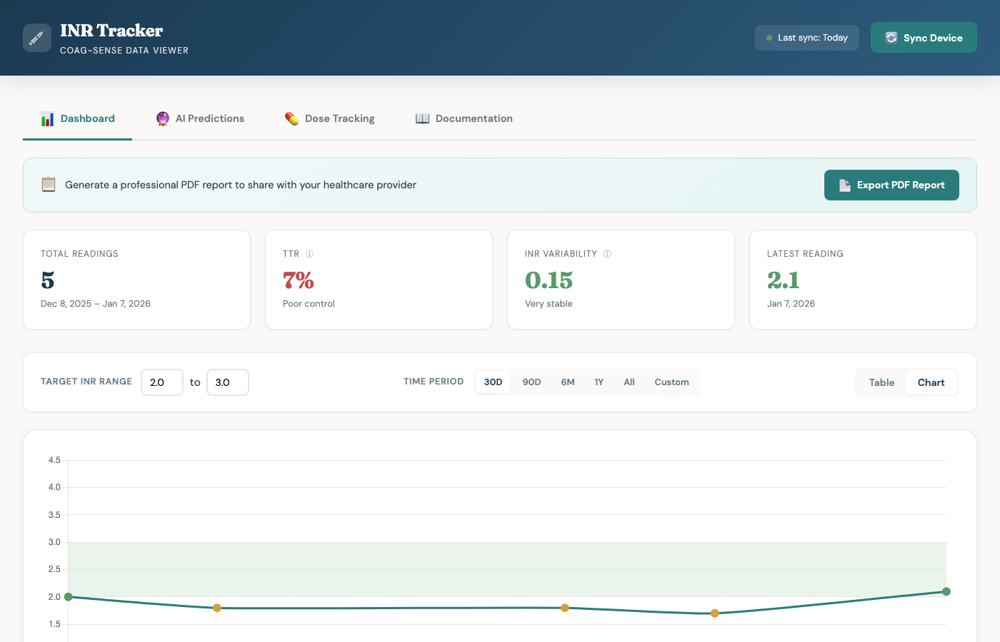
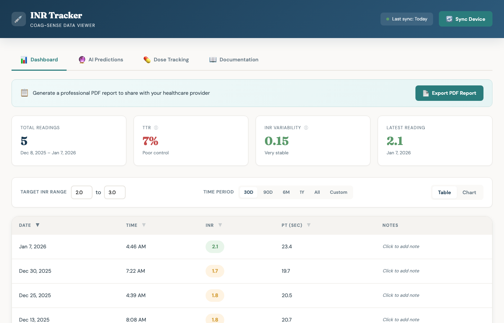
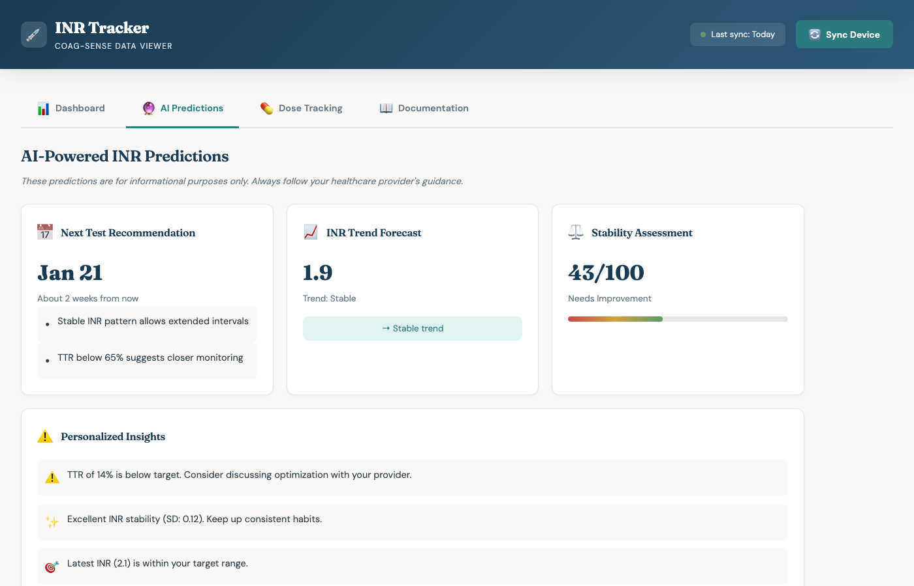
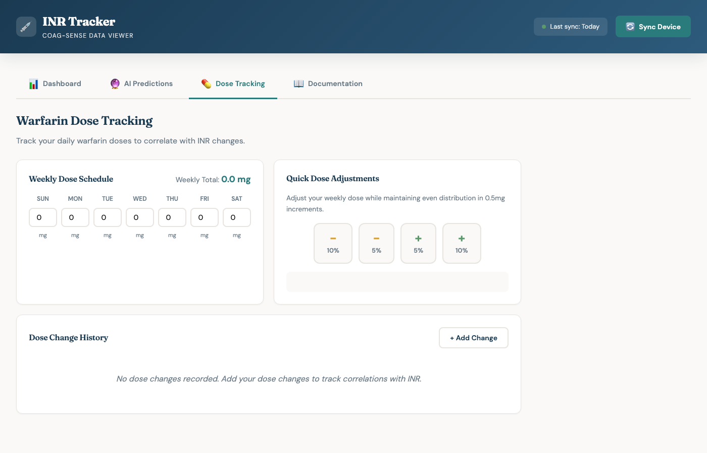
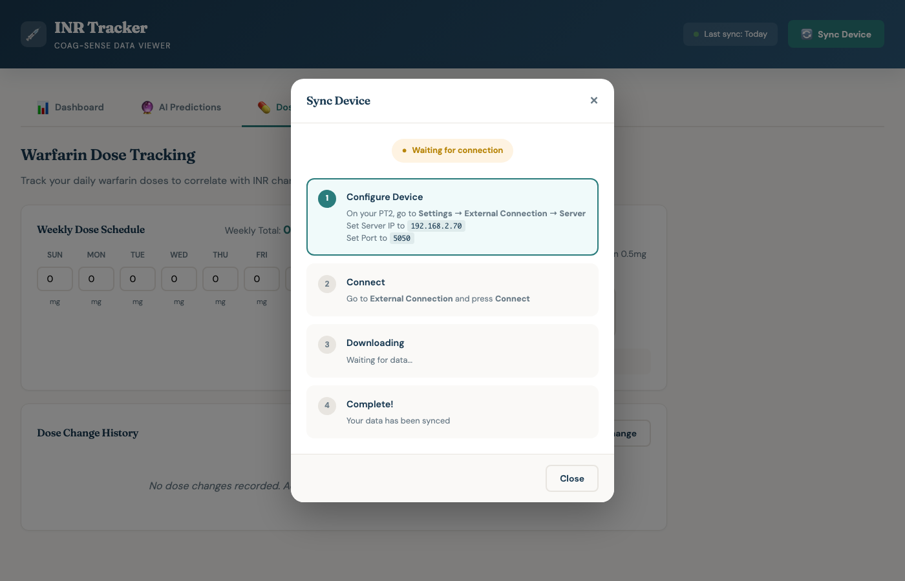

# Coag-Sense Tracker

> **Your INR data, your device, your computer. No cloud required.**

A local, open-source application to download, view, and analyze INR/PT test results from your **Coag-Sense PT2** device.


<p align="center">
  
</p>

<p align="center"><em>Works with the Coag-Sense PT2 INR/PT Monitoring System</em></p>

---

## Features

- **Real-time Sync** - Connect to your PT2 device over Wi-Fi and download all test results
- **Clinical Metrics** - TTR (Time in Therapeutic Range) using the Rosendaal method, INR variability
- **Interactive Dashboard** - Charts, tables, filtering by date range and target INR
- **Personal Notes** - Click any reading to add notes (illness, missed dose, diet changes, etc.)
- **AI Predictions** - Next test recommendations, INR trend forecasting, stability assessment
- **Dose Tracking** - Track your warfarin schedule with smart adjustment tools
- **PDF Export** - Generate professional reports to share with your healthcare provider
- **100% Local** - All data stays on your computer. No accounts, no cloud, no tracking.

---

## Screenshots

### Welcome Screen
Beautiful empty state for new users with quick-start guide.



### Dashboard
View your INR readings with an interactive chart, clinical metrics (TTR, variability), and color-coded target range.



### Table View
Sortable table with all readings. Click any row to add personal notes.



### AI Predictions
Get recommendations for your next test, trend forecasting, and stability assessment.



### Dose Tracking
Manage your weekly warfarin schedule with smart adjustment tools.



### Device Sync
Easy step-by-step connection wizard.



---

## Important Disclaimers

**Please read carefully before using this software.**

### No Affiliation

This software is an **independent, community-developed project**. It is:

- **NOT** affiliated with, endorsed by, or supported by CoaguSense, Inc.
- **NOT** affiliated with any medical device manufacturer
- **NOT** an official product or companion application
- **NOT** reviewed, approved, or certified by any regulatory body (FDA, CE, etc.)

"Coag-Sense" and "CoaguSense" are trademarks of CoaguSense, Inc. All trademarks belong to their respective owners.

### Not a Medical Device

This software is provided for **educational and personal informational purposes only**. It is:

- **NOT** a medical device
- **NOT** intended to diagnose, treat, cure, or prevent any disease
- **NOT** a substitute for professional medical advice, diagnosis, or treatment

**ALWAYS consult your healthcare provider** before making any decisions about your anticoagulation therapy. Never change your warfarin dose without guidance from your doctor.

### Unexpected Results

An unexpected result may include any result that falls outside your therapeutic target range, or a result that falls inside the target range but is not consistent with your current health status (e.g., experiencing bleeding or bruising).

**What can cause unexpected results:**
- Certain prescription drugs (e.g., heparin) and over-the-counter medications can affect oral blood thinners and INR values
- Changes in diet, lifestyle, or nutritional supplements (e.g., ginkgo biloba, vitamin K-rich foods)
- Medical conditions including liver disease, congestive heart failure, thyroid dysfunction, Lupus, and antiphospholipid antibody syndrome (APS)

**What to do with unexpected results:**
1. Follow instructions for re-testing on your Coag-Sense PT/INR Meter
2. Contact your healthcare provider to discuss the result
3. Consider re-testing using an alternative method prior to adjusting medication
4. For technical issues, contact CoaguSense Technical Support at 1-866-903-0890

### No Warranty / Limitation of Liability

This software is provided **"AS IS"** without warranty of any kind. **USE AT YOUR OWN RISK.** The authors are not liable for any damages, health outcomes, or other issues arising from use of this software.

### Privacy

- No data is transmitted to external servers
- No personal information is collected
- Only test results from your device are stored locally
- All data remains on your computer

---

## Quick Start

### Requirements

- Python 3.9+
- A Coag-Sense PT2 device with Wi-Fi enabled
- Both your computer and the PT2 on the same local network

### Installation

```bash
git clone https://github.com/davecap/coag-sense-tracker.git
cd coag-sense-tracker
python -m venv venv
source venv/bin/activate  # On Windows: venv\Scripts\activate
pip install -r requirements.txt
```

### Run the Application

```bash
python app.py
```

This starts:
- **Web server** on `http://localhost:8000`
- **Device server** on port `5050`

### Connect Your Device

1. Open `http://localhost:8000` in your browser
2. Click **Sync Device** in the header
3. **Connect your PT2 to WiFi** (first time only):
   - On your PT2, go to **Settings → Communication Settings → Wireless**
   - Turn wireless **On**, select your network, and connect
4. **Configure the server connection**:
   - Go to **Settings → Communication Settings → Server**
   - Enter the **Server IP** shown in the app modal
   - Set **Port** to `5050`
   - Press **Connect**
5. Watch your data download in real-time!

---

## Understanding the Metrics

### TTR (Time in Therapeutic Range)

Calculated using the **Rosendaal linear interpolation method** - the gold standard used in clinical trials. Rather than counting what percentage of tests were in range, it estimates what percentage of *time* you spent in range.

| TTR | Quality |
|-----|---------|
| ≥70% | Excellent control |
| 65-70% | Good control |
| <65% | Suboptimal - discuss with provider |

### INR Variability (Standard Deviation)

Measures the stability of your anticoagulation. Lower is better.

| SD | Stability |
|----|-----------|
| <0.5 | Very stable |
| 0.5-0.85 | Moderate |
| ≥0.85 | Unstable - higher risk |

---

## Project Structure

```
coag-sense-tracker/
├── app.py                 # Main application (FastAPI + WebSocket + POCT1-A)
├── requirements.txt       # Python dependencies
├── VERSION                # Current version number
├── static/
│   └── index.html         # Web application UI
├── docs/
│   ├── screenshots/       # Application screenshots
│   └── sample-report.pdf  # Sample PDF export
├── scripts/
│   ├── bump_version.py    # Version bump utility
│   └── reset_data.py      # Clear all synced data
├── captures/              # Raw XML data from device (gitignored)
├── inr_results.json       # Parsed results (gitignored)
├── CHANGELOG.md           # Version history
├── CONTRIBUTING.md        # Contribution guidelines
├── LICENSE
└── README.md
```

---

## How It Works

The Coag-Sense PT2 uses the **POCT1-A** protocol, an XML-based standard for medical device communication.

### Connection Flow

```
Device                          Server
  │                               │
  │──── HEL.R01 (Hello) ─────────>│
  │<──── ACK.R01 ─────────────────│
  │──── DST.R01 (Status) ────────>│
  │<──── ACK.R01 + REQ.R01 ───────│
  │──── OBS.R01 (Readings) ──────>│
  │<──── ACK.R01 ─────────────────│
  │      ... more readings ...     │
  │──── EOT.R01 (End) ───────────>│
  │<──── ACK.R01 ─────────────────│
```

---

## Data Storage

All data is stored locally on your computer. **Nothing is sent to external servers.**

### Server-Side Data (in project folder)

| File/Folder | Contents |
|-------------|----------|
| `inr_results.json` | Parsed INR/PT readings from your device |
| `captures/*.xml` | Raw XML data received from device |

### Browser Data (localStorage)

| Key | Contents |
|-----|----------|
| `inr_target_min/max` | Your target INR range |
| `inr_time_period` | Selected time filter |
| `warfarin_doses` | Weekly dose schedule |
| `dose_history` | Dose adjustment history |
| `note_seq_*` | Notes attached to readings |

### Resetting Data

**To clear synced readings:**
```bash
python scripts/reset_data.py
```

**To clear browser data (doses, notes, preferences):**
1. Open http://localhost:8000
2. Open Developer Tools (F12)
3. Go to Application → Storage → Clear site data

---

## Troubleshooting

### Device won't connect
- Verify both devices are on the same network
- Check your firewall allows port 5050
- Verify the server IP matches what's shown in the web interface

### No data received / "0 readings downloaded"
- Ensure the device has stored test results
- Check the terminal output for error messages
- Try restarting both the application and device
- **Important:** See "Data Transfer Behavior" below

### Data Transfer Behavior

The PT2 device tracks which readings have been transferred and **will not resend data** that has already been acknowledged by any server. This is important to understand:

- **Once synced, readings are marked as "sent"** on the device and won't transfer again
- **If you've connected to other systems** (hospital LIS, other data managers), those readings may already be marked as sent
- **Don't delete `inr_results.json`** after syncing - you cannot re-download the same data from the device
- **New readings will always transfer** - only readings taken after your last sync will appear as "new"

If you see "0 readings downloaded" but have data on your device, it likely means those readings were previously transferred to another system. Only readings taken after that transfer will be available.

**To recover old data:** Contact CoaguSense Technical Support (1-866-903-0890) to ask about resetting the transfer history on your device.

### Web interface not loading
- Make sure the application is running (`python app.py`)
- Check that port 8000 is not in use by another application
- Try `http://127.0.0.1:8000` instead of `localhost`

---

## Contributing

Contributions welcome! Please:
1. Fork the repository
2. Create a feature branch
3. Submit a pull request

See [CONTRIBUTING.md](CONTRIBUTING.md) for detailed guidelines.

---

## Versioning

Version is stored in the `VERSION` file and automatically displayed in the app footer.

**To release a new version:**

```bash
# Bump version (patch/minor/major)
python scripts/bump_version.py patch   # 1.0.0 -> 1.0.1
python scripts/bump_version.py minor   # 1.0.0 -> 1.1.0
python scripts/bump_version.py major   # 1.0.0 -> 2.0.0

# Edit CHANGELOG.md with your changes, then:
git commit -am "Bump version to X.Y.Z"
git tag vX.Y.Z
git push && git push --tags
```

See [CHANGELOG.md](CHANGELOG.md) for version history.

---

## License

MIT License - see [LICENSE](LICENSE)

---

## Acknowledgments

- Protocol analysis based on publicly available POCT1-A documentation
- Inspired by the need for patients to access their own health data
- Thanks to the open-source medical device interoperability community

## Related Resources

- [CLSI POCT1-A Standard](https://clsi.org/) (official specification)
- [IHE Laboratory Technical Framework](https://www.ihe.net/resources/technical_frameworks/#laboratory)
